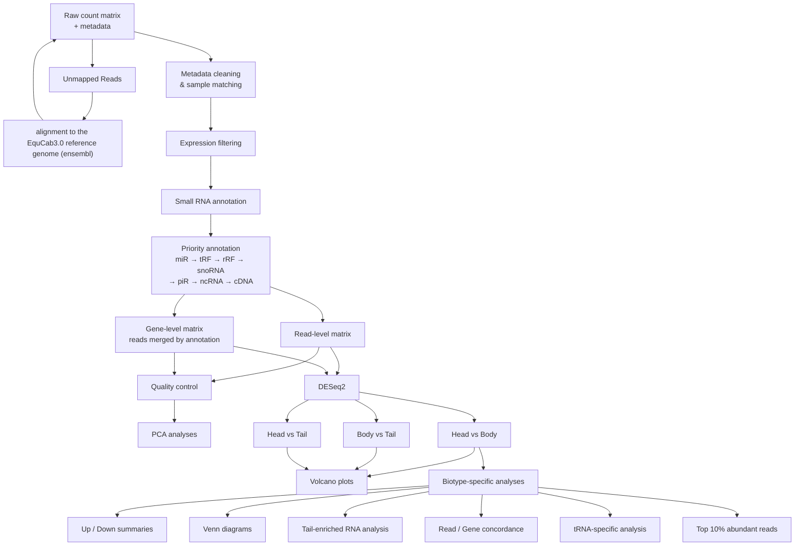

# 🧬 Epididymal small RNA-seq analysis pipeline

R-based workflow for the analysis of **small RNA-seq data during epididymal transit**:

**Head → Body → Tail**

The pipeline performs quality control, annotation, dimensionality reduction and differential abundance analyses at both **read/sequence** and **gene** levels.

---

## 🔬 Overview

This workflow was designed to investigate changes in small RNA populations across epididymal regions.

It integrates several small RNA classes:

* **miRNA**
* **tRF**
* **rRF**
* **snoRNA**
* **piRNA**
* **ncRNA**
* **cDNA-derived fragments**

The analysis includes both epididymal tissue and spermatozoa, with differential analyses focused primarily on spermatozoa collected from the **Head, Body and Tail** regions.

---

## 🔄 Workflow



---

## 📥 Input files

The pipeline currently expects:

```text
Count_matrix.tsv
QNS31219_metadata.txt
```

### Count table

The count matrix contains:

* small RNA sequences;
* raw counts for samples;
* annotation columns from multiple databases.

Sample columns are expected in the format:

```text
A01, A02, A03, ..., A42
```

### Metadata

The metadata file contains information including:

```text
Sample ID
Tissue type
Origin in Epididymis
Treatment
```

Epididymal regions are organized as:

```text
Head → Body → Tail
```

---

## 🧹 Expression filtering

Low-abundance features are removed before downstream analyses.

By default:

```r
min_count <- 10
```

A feature is retained when it reaches the minimum count in at least **50% of the samples from at least one major tissue group**.

This filtering step reduces noise while retaining RNAs that are specifically abundant in a given biological group.

---

## 🏷️ Annotation strategy

When several annotations are available for the same sequence, the pipeline assigns one prioritized annotation.

The current priority is:

```text
miRNA
  ↓
tRF
  ↓
rRF
  ↓
snoRNA
  ↓
piRNA
  ↓
ncRNA
  ↓
cDNA
```

This produces two main annotation variables:

```text
gene_name_priority
biotype_priority
```

Two expression matrices are subsequently generated.

### Read level

Each distinct sequence is treated as an individual feature.

```text
sequence + gene annotation → feature_id
```

### Gene level

Sequences sharing the same prioritized gene annotation are merged by summing their counts.

```text
multiple reads
     ↓
same gene annotation
     ↓
summed counts
     ↓
gene-level feature
```

---

## 📊 Quality control

The workflow generates several QC summaries, including:

* library sizes;
* distribution of reads per gene;
* RNA biotype composition;
* biotype proportions based on read counts;
* sample- and category-level biotype distributions;
* filtered dataset composition.

---

## 🧭 PCA analyses

Principal component analyses are performed using transformed count data.

The pipeline includes:

* global PCA across all samples;
* spermatozoa-only PCA;
* epididymis-only PCA;
* PCA by RNA biotype in spermatozoa;
* PCA by RNA biotype in epididymal tissue;
* combined spermatozoa + epididymis PCA.

These analyses allow visualization of sample clustering according to tissue, epididymal region and RNA biotype.

---

## 🌋 Differential abundance analysis

Differential abundance is performed using **DESeq2**.

Three main sperm comparisons are investigated:

| Abbreviation | Comparison   | Progression |
| ------------ | ------------ | ----------- |
| **HB**       | Head vs Body | Head → Body |
| **BT**       | Body vs Tail | Body → Tail |
| **HT**       | Head vs Tail | Head → Tail |

Default significance thresholds are:

```r
padj < 0.05
|log2FoldChange| >= 1
```

Analyses are performed at both **read level** and **gene level**.

---

## ⚠️ Fold-change direction convention

DESeq2 results retain the original contrast:

```text
group1 vs group2
```

Therefore, in the raw DESeq2 tables:

```text
log2FoldChange > 0  → higher in group1
log2FoldChange < 0  → higher in group2
```

For visualization, volcano plots are intentionally oriented according to epididymal progression:

```text
Head → Body → Tail
```

The displayed x-axis is inverted so that the **second group is always on the right**.

### Example: Head vs Body

```text
             Head        Body
              ←            →
         lower x          higher x
```

Thus, throughout progression-oriented figures:

```text
UP   = higher in the second group
DOWN = higher in the first group
```

Meaning:

| Comparison | UP means    |
| ---------- | ----------- |
| HB         | Body > Head |
| BT         | Tail > Body |
| HT         | Tail > Head |

This convention affects **visualization and Up/Down terminology only**. Original DESeq2 log2FoldChange values are preserved in exported result tables.

---

## 🌋 Volcano plots

Volcano plots are generated:

* at read level;
* at gene level;
* for all RNA classes;
* separately for individual RNA biotypes;
* for selected cDNA-derived features;
* for highly abundant read-level features.

The x-axis follows the biological progression convention, with the later epididymal region displayed on the right.

---

## 🧬 Biotype-specific differential analysis

Differentially abundant RNAs are summarized independently for:

```text
miRNA
tRF
rRF
snoRNA
piRNA
ncRNA
cDNA
```

For each comparison, the pipeline reports:

```text
Total features
├── Not DE
├── Upregulated DE
└── Downregulated DE
```

Stacked barplots summarize these changes across RNA biotypes.

---

## 🔗 Venn diagrams

Venn diagrams identify RNAs that increase toward the next epididymal region.

For example:

```text
Head → Body
       ∩
Body → Tail
```

This makes it possible to identify RNAs showing consistent enrichment during epididymal progression.

---

## ➡️ Epididymal transition 

Biotype-specific schematic figures summarize differential changes along:

```text
HEAD  ───────▶  BODY  ───────▶  TAIL
          HB                BT
```

The figures highlight RNAs that are more abundant in the **second region**, i.e. in the direction of the arrow.

The direct comparison is also evaluated:

```text
HEAD  ─────────────────────▶  TAIL
                 HT
```

---

## 🐎 Tail-enriched small RNAs

A dedicated analysis focuses on small RNAs enriched in **Tail spermatozoa**.

Original contrasts:

```text
Head vs Tail
Body vs Tail
```

are re-oriented for interpretation as:

```text
Tail vs Head
Tail vs Body
```

The analysis combines differential abundance with measures of RNA abundance, including mean/median counts, CPM and within-biotype abundance percentiles.

This can help distinguish highly significant but rare RNAs from RNAs that are both **Tail-enriched and abundant**.

---

## 🧩 Read-level vs gene-level concordance

The pipeline compares differential abundance results obtained at:

```text
individual sequence/read level
            ↕
       merged gene level
```

This allows identification of cases where individual RNA fragments and their corresponding aggregated gene annotation show concordant or discordant differential patterns.

---

## 🔥 Correlation analyses

Sample correlation heatmaps are generated by RNA biotype to assess similarity between samples and visualize region-specific expression patterns.

---

## 🧬 tRNA-derived RNA analysis

A dedicated analysis investigates differential read-level features associated with **tRNA genes**.

The pipeline calculates the proportion of reads from each tRNA gene showing differential abundance across epididymal comparisons.

---

## ⭐ Top 10% most abundant reads

The workflow also identifies the **top 10% most abundant read-level features**, based on mean CPM.

These highly abundant small RNAs are characterized according to:

* RNA biotype;
* gene annotation;
* sequence;
* abundance rank;
* tissue distribution.

A dedicated **Head vs Tail DESeq2 analysis** is then performed within this highly abundant subset.

---

## 📁 Main outputs

Results are written to:

```text
Figures/
```

with dedicated subdirectories including outputs for:

```text
PCA
Volcano plots
Biotype-specific analyses
DE summaries
Venn diagrams
Transition schematics
Tail-enriched RNAs
Read/gene concordance
Correlation heatmaps
tRNA analyses
Top 10% abundant reads
```

Most analyses generate both:

```text
.pdf     → figures
.tsv     → underlying data/results
```

---

## 📦 Main R dependencies

The workflow uses:

```r
tidyverse
readr
tibble
ggplot2
ggrepel
ggforce
VennDiagram
DESeq2
SummarizedExperiment
pdftools
```

Missing packages are automatically installed by the script.

---

## ▶️ Running the analysis

Clone the repository:

```bash
git clone <repository-url>
cd <repository-name>
```

Place the count and metadata files in the project directory:

```text
<repository>/
│
├── table_with_v1_biotypes_filled.tsv
├── QNS31219_metadata.txt
├── analysis.Rmd
└── README.md
```

Update the working directory or input paths in the R script if necessary.

Then run or knit the R Markdown analysis.

The pipeline will automatically create:

```text
Figures/
```

and its analysis-specific subdirectories.

---

## 🗂️ Suggested repository structure

```text
smallRNA-epididymis/
│
├── README.md
│
├── analysis.Rmd
│
├── data/
│   ├── counts/
│   └── metadata/
│
├── Figures/
│   ├── PCA_by_biotype_SPZ/
│   ├── PCA_by_biotype_Epididymis/
│   ├── Volcano_read_level_SPZ/
│   ├── Volcano_gene_level_SPZ_all_genes/
│   ├── Volcano_gene_level_SPZ_by_biotype/
│   ├── Barplot_DE_genes_by_biotype/
│   ├── Venn_gene_level_SPZ_up_by_biotype/
│   ├── Relative_abundance_Tail_enriched_DE/
│   └── Top10_percent_most_abundant_reads/
│
└── results/
```

> **Note:** The current script writes results directly to `Figures/`. The structure above is a suggested organization for a public GitHub repository and can be adapted as needed.

---

## 🧠 Biological interpretation

The workflow is designed to describe **small RNA remodeling during sperm epididymal transit** rather than transcriptional activation in spermatozoa.

For sperm samples, terms such as *higher abundance*, *enriched*, *increased* or *decreased* are therefore generally more appropriate than interpreting all changes as de novo gene expression.

---

## 📌 Summary

```text
Small RNA counts
      │
      ▼
Filtering & annotation
      │
      ├───────────────┐
      ▼               ▼
 Read level       Gene level
      │               │
      └───────┬───────┘
              ▼
         QC & PCA
              │
              ▼
           DESeq2
              │
      ┌───────┼────────┐
      ▼       ▼        ▼
     HB      BT       HT
      │       │        │
      └───────┼────────┘
              ▼
     Head → Body → Tail
              │
              ▼
       Biotype-specific
          remodeling
```

---

### Main analysis direction

**Head → Body → Tail**

**HB Up = Body enriched**
**BT Up = Tail enriched**
**HT Up = Tail enriched**

🧬 **Read-level + gene-level small RNA analysis**
📊 **PCA + DESeq2 + volcano plots**
🔗 **Biotype summaries + Venn diagrams**
➡️ **Epididymal transition analysis**
🐎 **Tail-enriched small RNA characterization**
